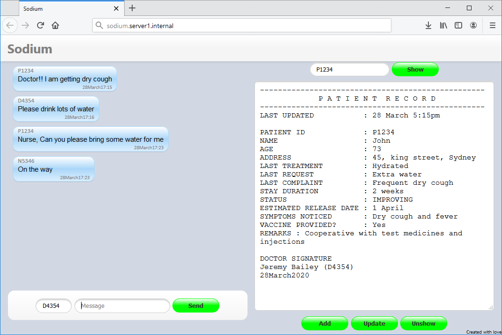

# Sodium
An app that connects patients and doctors with social distancing for COVID-19

**Sodium - SOcial DIstance Unto Medicos**

This app connects patients, doctors and nurses with social distancing.

Given, "Social distance" as the only remedy out of COVID-19, along with general public, It is necessary for doctors to social distance with patients. Though doctor-patient contact cant be eliminated completely, my app tries to reduce realworld contact as much as possible, unless necessary.

 #sodium #COVID19 #coronavirus
 
### Features
* Inbuilt customized-http implementation
* Dead low memory utilisation and faster
* Easy to install with no external dependancy
* Compatible to both local network and internet
* Can be used in floor-networks or inhouse and internet domains
* No special infrastructure required. Just a laptop or a raspberry pie is enough.
* No end-user installarion
* Multi platform suppprt

@Developers forks and improvents are welcome.

